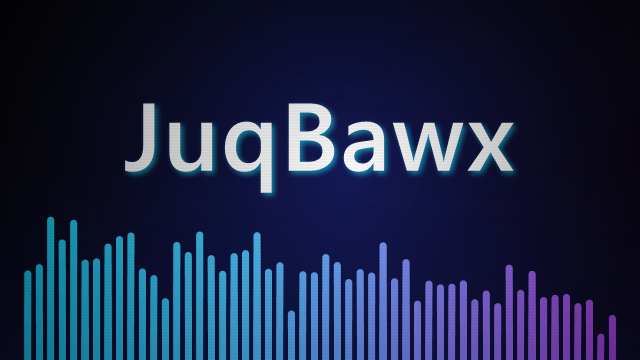

# JuqBawx

A music visualizer for [Lively Wallpaper](https://github.com/rocksdanister/lively). It listens to
whatever Windows is playing (YouTube Music, Spotify, a browser tab, a local player, a video) and
paints your desktop with it. 36 visualizers, from faithful Winamp scopes to MilkDrop-style feedback
tunnels to fragment-shader fluid.



## Install

1. Grab the latest `JuqBawx-Lively-Visualizer-*.zip` from Releases, or build it yourself (below).
2. Drag the ZIP onto **Lively Wallpaper**, or use **Add Wallpaper → Browse**.
3. Right-click the wallpaper and pick **Customise** to get at the controls.

Lively needs to launch it with `--audio --system-nowplaying`. That's already in `LivelyInfo.json`,
so it happens automatically.

## The visualizers

Every visualizer declares its own categories. Picking a **Visualizer category** constrains
auto-cycle to that family, and jumps you to a member of it if the current scene isn't one. Lively's
sub-theme dropdown still lists all 36 either way; its property API is one-way, so the wallpaper
can't shorten the list.

| Category | Visualizers |
| --- | --- |
| Modern / Neon | Neon Spectrum, Mirrored Horizon, Radial Bloom, Particle Constellation, Aurora Wave, Polar Oscilloscope, Starlight Rings, Prism Scope, Ribbon Helix, Skyline Pulse, Orbiting Orbs, Galactic Equalizer |
| Winamp Classics | Winamp Classic Spectrum, Winamp Classic Oscilloscope, AVS Laser Grid, Retro VU Towers, Dot Matrix Analyzer, CRT Scope Deluxe, Winamp Tri-Band Analyzer, Winamp Dot Scope, Cassette Deck |
| MilkDrop Psychedelic | Plasma Tunnel, Kaleidoscope Bloom, Feedback Tunnel, MilkDrop Petals, MilkDrop Spiral Feedback, MilkDrop Fractal Flower |
| Retro Hardware | Winamp Classic Spectrum, Winamp Classic Oscilloscope, Retro VU Towers, Analog Needle Deck, Dot Matrix Analyzer, CRT Scope Deluxe, Winamp Tri-Band Analyzer, Winamp Dot Scope, Cassette Deck |
| Ambient / Chill | Radial Bloom, Particle Constellation, Aurora Wave, Polar Oscilloscope, Starlight Rings, Ribbon Helix, Orbiting Orbs, Galactic Equalizer, Album Mosaic, Bioluminescent Tide, Now Playing Dossier |
| Shader Lab | Plasma Tunnel, Feedback Tunnel, MilkDrop Petals, MilkDrop Spiral Feedback, MilkDrop Fractal Flower, Liquid Chrome |
| Procedural Worlds | Radial Bloom, Starlight Rings, Kaleidoscope Bloom, Wireframe Reactor, Galactic Equalizer, Spectral Terrain, Polyhedral Bloom |
| Album Atmospheres | Aurora Wave, Starlight Rings, Ribbon Helix, Orbiting Orbs, Album Mosaic, Bioluminescent Tide, Now Playing Dossier |
| Interactive | Particle Constellation, Orbiting Orbs, Kaleidoscope Bloom, Liquid Chrome, Spectral Terrain, Album Mosaic, Gravity Garden, Polyhedral Bloom |

A few worth calling out:

- **Now Playing Dossier** is a still, full-screen readout of everything the Windows media session
  exposes: artwork, title, artist, album artist, collection, track position, genres, playback type,
  and subtitle or episode detail. A slow album-tinted glow and a thin audio trace are the only
  motion. It recognizes video as well as audio through the reported `PlaybackType`. Playback
  position, duration, source app, and transport state are missing because Lively's Now Playing
  payload doesn't include them, and the dossier doesn't invent them.
- **Kaleidoscope Bloom** draws one audio-reactive stained-glass wedge and mirrors it around the
  center, so the seams actually line up. Symmetry, facet complexity, zoom, and rotation direction
  are all adjustable.
- **Gravity Garden** is a persistent particle ecosystem. Click or press to send an impulse through
  it.
- **Album Mosaic** tiles the cover art and colors the tiles from a five-stop palette sampled off
  the artwork.

## Controls

Everything lives in Lively's **Customise** panel.

**Selection.** Category and sub-theme dropdowns, plus a preset pack. Five packs are style presets
(Custom, Retro, Chill, Aggressive, Psychedelic); the other seven pin auto-cycle to one family —
Winamp Classics, MilkDrop Psychedelic, Shader Lab, Procedural Worlds, Album Atmospheres, Ambient
Rooms, and Interactive Playground.

**Audio response.** Sensitivity, bass boost, beat pulse, and motion smoothing.

**Motion and image.** Animation speed, color saturation, visual contrast, glow, trails, spectrum
detail, color mode, primary/secondary colors, and background.

**Post-processing.** Faux CRT overlay with scanline strength, edge vignette, and an optional beat
flash. **Beat flash is off by default** — rapidly changing light can be uncomfortable or unsafe for
photosensitive viewers, so it is strictly opt-in.

**Album art.** When Windows exposes cover art, JuqBawx samples it for a five-color palette and can
render a heavily blurred, low-opacity copy behind the visualizer. **Album art influence** controls
how far that goes.

**Pointer interaction.** Turn on **Pointer-reactive visuals** and pick attract/bend, repel/scatter,
or orbit/swirl. Lively needs wallpaper mouse input enabled for any of this to fire; every affected
visualizer keeps moving on its own when it isn't available.

**Ambient motion level** raises or lowers the motion floor of the calm scenes without touching
global animation speed. The Ambient Rooms pack also damps beat response and forces beat flash off.

**GPU render quality** scales the internal render resolution of every visualizer, and the offscreen
buffers of the WebGL scenes on top of that. Balanced is the default; Eco saves power, High is
sharper.

## Per-sub-theme profiles

**Remember customization per sub-theme** saves the audio, motion, color, background,
post-processing, and Kaleidoscope controls separately for each visualizer, and writes them whenever
a control changes or you switch scenes.

The catch: Lively's property API is one-way. The wallpaper can restore a saved profile and render
it, but it can't push the values back into the visible Lively sliders, so the panel and the screen
will disagree until you touch a control. **Reset current sub-theme profile** puts the shipped
defaults back, and **Copy current profile to every sub-theme** gives everything the same starting
point.

Profiles live in browser storage. Turn on Lively's web disk cache if you want them to survive a
full restart of the wallpaper player; without it they only last the session.

## WebGL

Skyline Pulse, Kaleidoscope Bloom, Galactic Equalizer, and Liquid Chrome compile to WebGL 1
fragment shaders when a context is available. They share one context, one fullscreen triangle, and
a lazily compiled program cache in `src/core/gpu.js`.

Failures are isolated per program. If a context can't be created, a shader won't compile, a program
won't link, or the context is lost, that scene logs a warning and drops to its CPU path: Canvas for
the first three, a lower-resolution per-pixel renderer for Liquid Chrome. The others keep running on
the GPU.

There's no WebGPU, CUDA, or Vulkan anywhere in here, on purpose: Lively's wallpaper players are
WebView2 and CEF, and WebGL 1 is what they can be relied on to have.

## Building

From the repository root:

```powershell
.\build.ps1
```

This checks `LivelyProperties.json` against the visualizer registry, runs both smoke tests, then
writes `dist/JuqBawx-Lively-Visualizer-v<version>.zip`, taking the version from the `version` file.
Pass `-SkipTests` to skip the checks, or `-OutputPath` to put the ZIP somewhere else:

```powershell
.\build.ps1 -OutputPath .\dist\JuqBawx.zip
```

## Project layout

```
index.html            the script tags are the module manifest and the load order
styles.css
src/
  core/               shared runtime, one concern per file
    namespace.js      the JuqBawx global, register(), registry lookups
    state.js          settings, presets, packs, the category taxonomy
    dom.js            element lookups and the drawing surface
    audio.js          Lively's audio bridge, smoothing, beat detection, resampling
    color.js          palettes and album-art color sampling
    canvas.js         sizing, background clearing, shared drawing helpers
    gpu.js            the shared WebGL context and program cache
    fields.js         particle fields used by more than one visualizer
    profiles.js       per-sub-theme profiles, keyed by visualizer id
    nowplaying.js     media-session metadata and the dossier DOM
    screenfx.js       scanlines, beat flash, vignette
    properties.js     Lively's property bridge and theme switching
    frame.js          the render loop and dispatch
  visualizers/        one file per visualizer
  boot.js             startup wiring, loads last
tools/
  headless.cjs        mocked-DOM loader shared by the test and the sync tool
  sync-properties.cjs regenerates the Lively dropdowns from the registry
smoke-test.cjs        renders every visualizer under Node
```

There is no build step and no bundler. Lively loads `index.html` off disk over `file://`, where
Chromium refuses to load ES modules, so everything is a classic script and the tags in
`index.html` are the dependency order.

## Adding a visualizer

**1. Write `src/visualizers/your-scene.js`.** Each file is its own IIFE, so per-scene state is just
a local variable:

```js
(() => {
  'use strict';

  let ripples = [];

  JuqBawx.register({
    id: 'your-scene',                       // stable key: profiles, budgets, tests
    name: 'Your Scene',                     // badge text and Lively dropdown label
    categories: ['modern', 'ambient'],      // any category ids from src/core/state.js
    tuning: { sensitivity: 1, glow: 1.1, trail: 0.9, beat: 1 },  // optional
    resize(fx) { ripples = []; },           // optional, on size or quality change
    draw(fx, t) {
      const { ctx, width, height, runtime, resample, palette, clearBackground } = fx;
      clearBackground();
      const bars = resample(runtime.barCount);
      bars.forEach((v, i) => {
        ctx.fillStyle = palette(t, i / bars.length, 0.6);
        ctx.fillRect(i * (width / bars.length), height - v * height, width / bars.length - 1, v * height);
      });
    }
  });
})();
```

`id`, `name`, and `draw` are required. Add `label` if the Lively dropdown should say something
other than `name`. Add `invalidate()` if the scene caches a surface that has to be thrown away when
GPU render quality changes.

**2. Add one script tag to `index.html`**, in the position you want it to occupy in the dropdown,
after the core scripts and before `src/boot.js`.

**3. Sync and test.**

```powershell
node tools/sync-properties.cjs
node smoke-test.cjs
$env:MOCK_WEBGL = "1"; node smoke-test.cjs; Remove-Item Env:\MOCK_WEBGL
```

Removing a visualizer is the same in reverse: delete the file, delete the script tag, re-run those
commands. Profiles and draw-call budgets key off `id`, so nothing else shifts.

### The fx object

`fx` is a single object refreshed every frame. Destructure what you need at the top of `draw`, and
don't hold onto a scalar from it across frames.

| Group | Members |
| --- | --- |
| Surfaces | `ctx`, `width`, `height`, `dpr` |
| Settings | `runtime` (settings + preset + tuning), `settings` |
| Audio | `audio`, `previous`, `bass()`, `mids()`, `highs()`, `energy()`, `beat`, `resample(n)`, `avg(arr, a, b)` |
| Motion | `frameMotionScale`, `pointer` |
| Paint | `palette()`, `paletteStops()`, `colorFromStops()`, `rgba()`, `clearBackground()`, `baseBgColor()`, `trailAlpha()`, `backdropGlow()`, `roundedRect()`, `pulse()`, `refreshPaletteCache()`, `cachedPaletteRgb` |
| Album art | `albumArtEl`, `albumArtReady`, `albumPalette`, `albumPrimary`, `albumSecondary`, `drawAlbumArtBackdrop()` |
| GPU | `renderGpuScene()`, `renderCustomGpuScene()`, `compositeGpuScene()`, `gpuCanvas` |
| Shared fields | `stars`, `particleSeed` |
| Math | `clamp`, `lerp`, `TAU` |

### Adding a WebGL scene

Keep the fragment shader in the visualizer's own file and prepend `JuqBawx.gpuCommon`, which
supplies the standard uniforms and helpers. Call `renderGpuScene(key, shader, t, params)` and fall
back to Canvas when it returns false:

```js
draw(fx, t) {
  if (fx.renderGpuScene('your-scene', FRAGMENT_SHADER, t, [a, b, c, d])) {
    fx.compositeGpuScene();
    return;
  }
  // Canvas fallback
}
```

Use `renderCustomGpuScene` if the scene needs a uniform set of its own. Liquid Chrome is the worked
example.

## License

MIT. See [LICENSE](LICENSE).
